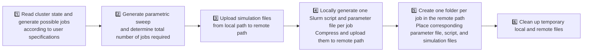

# matlab-slurm-sweeper
> Distributed parameter sweep manager for MATLAB + Slurm clusters

This software suite is designed to send parametric sweeps to distributed clusters that use Slurm as a queue manager, and then fetch the results. 

## 📖 Overview
This program attempts to solve the problem of spreading a parametric sweep of a given program across different computing nodes of a cluster. This suite contains two main programs, that work through a GUI: 
- ClusterJobDistributiorUI: which handles resource availability, job generation, parameter assignation, file population in the remote cluster, and job inicialization.  
- ClusterUpdateDataSyncUI: which once the jobs are done, serves to fetch the desired output files from the parametric sweep.
For a broader explanation if capabilities see the next sections.

## ⚙️ Features
- GUI-based submission and synchronization
- Automatic Slurm script generation with keyword capabilities
- Resource-aware job management
- Flexible parameter sweep generation
- Ability to save configurations
- Ability to directly batch jobs from GUI
- Result synchronization via scp
- Ability to update on the fly for ongoing sweeps
- Multiple sweeps can be updated to multiple local folders
- Configurable for multiple remote clusters

## 📂 Repository Structure
| File | Description |
|------|--------------|
| `ClusterJobDistributorUI.m` | GUI for configuring and launching parameter sweeps |
| `ClusterUpdateDataSyncUI.m` | GUI for fetching results |
| `/C_J_D_functions/` | Auxiliary functions |
| `ssh2_v2_m1_r7.zip` | SSH and file-handling utilities implemented by David Freedman in [^1]|

## 🧩 Installation
To use the program, download the contents of the repository to the desired destination folder, where the program will be executed. It is advised that all the files are kept within its own folder (e.g. ./matlab-slurm-sweeper/). Finally unzip the contents of the ssh2_v2_m1_r7.zip to a folder with the same name and the different programs can be called from a matlab instance. 

## 🚀 Usage
In this section I describe the usage and GUI interface of the different programs. Both GUIs are structured using tab groups. For each of the programs I will now explain the usage and functionality of the different parts of the GUI. 

### **ClusterJobDistributiorUI**: Creating and Launching Jobs 
This program is designed to automatize the workflow of creating and running a parametric sweep in a HPC cluster. For this, the program checks a HPC's state, and creates a list of available jobs depending on user specification and hardware limitations. Then, it uses the provided parameter lists and generates appropriate parameter combinations (as specified) and assigns a job slot to each parameter combination. Then it creates a unique folder for each parameter combination and uploads:
- a parameter file: containing the parameter values of the program run.
- a slurm job script, which has been particularized for the job parameters and user-defined batch command.
- The files needed to run the program, as specified by the user.

Then, the program contains functionality to directly batch all the created jobs. 
To configure this workflow, the GUI is structured in different tabs. In what follows, I list the different tabs and explain the different fields: 
#### **<ins> Cluster Settings </ins>**
This tab contains the details to configre the ssh connection to the HPC cluster. You can specify the Hostname, username and your password. Note that Hostname and Username will be stored between sessions, but the password will not. 

Once the details are introduced, you can hit the *Test Connection* button, to test that the connection is possible. 

#### **<ins> Jobs Configuration </ins>**
This tab contains all the specifications to determine the possible jobs to launch in the HPC. The available options are:
| Field | type | Description|
|------|-----|--------------|
| Ignore State | on/off | Ignores occupation state of the nodes in the HPC cluster and assumes all nodes are *idle*. Enabling this option directly overrides the *Use Mixed* option (see below). |
| Use Mixed | on/off | If enabled, the program will use the available resources in nodes that have *mixed* status (not completely filled). |
| Fill Nodes | on/off | If enabled, the program will assign free CPUs (that couldn't be assigned to a new job due to insufficient memory or CPU count) to existing available jobs, increasing resources. |
| Random Distrib | on/off | If enabled, the available jobs are shuffled in order. By default the jobs are sequentially ordered by compute node.|
| Bigger First | on/off | If enabled, the job list is ordered by decreasing number of CPUs assigned to each job. |
| Force Node Execution | on/off | If enabled, the job will be executed in the particular compute node where resources were available at the time of querying. When disabled, the jobs have the flexibility to go into any of the compute nodes that belong to the same queue. |
| Prefered CPUs | integer | Default number of CPUs to assign to each job. |
| Min. CPUs | integer | If insufficient CPUs to assign the preferred number of CPUs to a job, this stablishes the minimum number of CPUs acceptable to be assigned to a job. |
| Minimum Memory | numeric | Minimum amount of total memory (in MB) that has to be reserved for a given job. |
| Delete Queues | string | Comma-separated list of the queues that the user may want to exclude from the job generation. By default, the program generates possible jobs to fill the complete cluster. To see the Queues that exist in the cluster, I implement the *List Queues* button. |
| Delete Nodes | string | Comma-separated list of the compute nodes that the user may want to exclude from the job generation. By default, the program generates possible jobs to fill the complete cluster. To see the Nodes that exist in the cluster, I implement the *List Nodes* button. |

**Note about the behavior regarding minimum resources**: By default, the program determines whether the limiting factor is CPU count or total memory. It then adjusts the counterpart resource accordingly, redistributing any excess to maximize cluster usage.

A series of buttons are provided to help setting up the resource allocation and limits. These are: 
| Button | Effect | 
|------|-----|
| Cluster State | Issues a structured sinfo command that returns the cluster state. The list of nodes is filtered so that the nodes belonging to either the *Delete Queues* and/or *Delete Nodes* list are removed. The output contains the fields: *PARTITION* (Queue), *HOSTNAMES* (Compute Node), *CPUS(**A**llocated/**I**dle/**O**ther/**T**otal)*, *MEMORY*, *FREE_MEM*, *STATE*, which corresponds to the output of *sinfo -a -S %P,hostname -o "|%13P|%13n|%13C|%13m|%13e|%8T|"*. This command is what is internally parsed to generate the possible jobs. 
| List Queues | List all the different queues of the cluster. | 
| List Nodes | List all the different nodes of the cluster. | 
| Enumerate Possible Jobs | Generate a list of possible jobs, according to cluster state and user specifications. The list is outputted to the Log area and contains the following columns: *Queue, NumCpus, MempCPU, Node, Node_lookout* and *Limitation*. These respectively indicate the queue, the number of assigned CPUs, the memory per CPU assigned to the Job (so that the total memory is larger than the minimum required memory) and the prescribed compute node. For the last two columns, *Node_lookout* indicates whether the job will be forced to execute at the indicated compute node or can be run at any compute node belonging to the same queue, and *Limitation* shows whether the particular job has excess Memory (CPU_bound), or excess CPUs (Memory_bound).| 

Then, the next section is **Cluster command**, where the user can specify the command to batch in the slurm script. The program accepts multiline inputs. For added flexibility, a series of keywords are defined that are used to adapt the slurm scripts, but can also be used to adapt the Cluster command for each of the jobs. The keywords are as follow:
| Keyword | Quantity | 
|------|-----|
| %JOBNAME | Name that will appear in the slurm queue|
| %QUEUE | Cluster queue |
| %NODE | Compute node name |
| %NCPUs | Number of CPUs assigned to the job |
| %MEMpCPU | Memory per CPU assigned to the job |
| %RUN_COMMAND | Cluster command to run on each job. This should only be used in the slurm template script, since otherwise it leads to circular dependencies. |
| %ModelFile | Simulation file from the file management section. **Note** that if more than one simulation file is specified in the file management section, the user will have to hard code the name of the main simulation file |

From this, a valid string to run a Comsol Multiphysics batch command would look something like:
>module load Comsol/56 \
>comsol batch -np %NCPUs -inputfile %ModelFile -outputfile Solved.mph -batchlog Record.log

where the program will substitute the keywords %NCPUs and %ModelFile by the appropriate strings when composing the actual slurm script.
        
Finally, we have a **Load/Save Configuration** area. By default, all the fields of the GUI (except user password) are saved in the local folder when the GUI is closed, and also can be automatically saved to the local path of the simulation files when the full pipeline is executed (see execution tab). Nevertheless, for archival purposes, I implemented *Save* and *Load* buttons that allow to save the current configuration and load and old one from specific folders by browsing to desired folders.

#### **<ins> Parameter Sweep </ins>**
This section defines the parameters over which to sweep. The UI has several parts:
- **Variables table**: A table with pairs of *Variable Name* and *Values*. The values have to be specified as vectors with Matlab syntax.
- **+Add Variable**: Button ads a row to the Variables Table.
- **-Remove Selected**: When a Variable is selected, hitting this button removes the particular variable.
- **All combinations**: When enabled, the parameter sweep includes every possible combination of parameter values across all defined variables (Cartesian product).
When disabled, the sweep instead pairs parameter values by their position in each list, i.e., the first value of each variable forms the first job, the second values form the second job, and so on. In this mode, all value lists must have the same length.
- **Test Job Count**: This button takes the current state of the parameter sweep and calculates the number of jobs that the sweep supposes. This is useful to check that the sweep generation is working as expected and to match the number of available jobs to the number of parameter combinations.

Note that the way that the parametric sweep is implemented relies on generating a parameter file (which can be specified by the user), which contains the parameter values of each job. These values are written as row-wise name-value pairs. Therefore, in order for this sweep strategy to work, the simulation program/calculation specified by the user must be able to read-in and parse this text document. 

#### **<ins> File Management </ins>**
In this tab we specify the information regarding the required simulation files, their local path, the HPC's remote path where the simulations will be run, and the details about slurm script and parameter file naming. The text fields contained in this tab are:
|Fields |Description |
|----|-----|
| Model File(s) | Comma separated list of the files that are necessary for the desired simulations. All of these must be contained within the same Local Path. If only one simulation file is specified, then the keyword *%ModelFile* introduced in the Jobs Confiuration tab is directly replaced in the slurm script by the name of the selected simulation file. |
|Local Path|Local direction of the simulation files. |
|Remote Path| Direction in the cluster where the parametric sweep will be run. |
|Starting Folder #| By default, one folder is created within the Remote Path directory for each job. These folders are sequentially labelled as integers. If the user wishes to send more parameter values to the same remote directory, this option allows to number the folders starting from a number different than 1. |
|Parameter file name | The name of the text file containing the parameter values for each job.|
|Script file name | The name of the Slurm script created for each individual job.|

Besides these fields, the UI provides two buttons: 
|Button |Action |
|----|-----|
| Browse... | Opens a dialog that explores the file system and allows to manually search for the simulation files. This allows to select multiple files. After selection, the names of the files will be introduced into the *Model File(s)* text field, and the path introduced into the *Local Path* field. |
| Upload Model | Uploads the simulation file(s) to the remote path.|

#### **<ins> Execution </ins>**
In this tab one finds two different sections:
- Job Creation: In short, this launches the pipeline responsible for creating the parametric sweep in the remote location. More details below.
- Job Launching: Runs through specific folders in the *Remote Path* location and runs the corresponding Slurm scripts to queue the different jobs.
##### Job Creation Section
In this section we find several UI components:
|UI component| type |Action |
|----|-----|--|
| *Automatically save configuration file to simulation file folder*| Toggle |When enabled and the Full Pipeline is executed, a configration file with all the current parameters of the sweep generator is saved to the *Local Path* specified in the File Management tab.|
|auto_config.mat|string|when the complete pipeline is executed, the current configuration will be saved to a *.mat* file with the specific name|
|Run Full Pipeline|Button|Execute the complete pipeline to generate the parametric sweep. More details below.|

The workflow upon hitting on the *Run Full Pipeline* button proceeds through the following stages:

In Step 3, the simulation files are uploaded to the cluster so that when we populate the simulation folders in step 5 we can do so by issuing local *cp* commands in the remote machine, avoiding unneccesary data transmission over the internet. In the same way, transmitting all the Slurm scripts and parameter files in a single compressed file allows much faster data communication and remote folder population, since it can all be done through bash commands issued to the remote machine. After executing the pipeline, the *Remote Path* folder should be filled of newly created subfolders, where each of these corresponds to a different job. If the simulations have been previously tested, the user can directly launch them in bulk through the implementation of the functionalities in the *Job Launching Section*.

##### Job Launching Section
In this section we find several UI components:
|UI component| Description |
|----|-----|--|
| Text-Field | Specify the particular simulation folders that the user wants to run. These have to be specified as a comma separated list of numbers corresponding to the created simulation folders. Ranges can be specified by dashes.|
|Toggle *All*| When enabled, text-field is disabled and the program attempts to run all the numeric-labelled folders in the *Remote Path* folder.|
|*Batch Specified Jobs* Button|When hit, the program goes to the *Remote Path* and runs the Slurm script contained in the folders as specified by the components above.|

**Note** that if the simulations have not been thoroughly tested, the bulk submission of many different jobs results in high occupancy of the cluster and possible generation of large amounts of junk data associated with unexpected program terminations. For this reason, we advise to only use this Bulk-Batching functionality once the simulations are under control.

**In summary**, the ClusterJobDistributorUI automates the end-to-end process of distributing parameter sweeps across a Slurm cluster — from querying available resources, generating job scripts, and uploading input files to organizing results in well-defined folders.

### **ClusterUpdateDataSyncUI**: Synchronizing Results,
This program is designed to automatize the workflow of fetching the result files from a parametric sweep generated with **ClusterJobDistributorUI**. It can also update running jobs to fetch the most up to date files. 
The program is also structured with tabs containing the different settings and parameters that configure the different functionalities. In what follows, I list the different tabs and explain the different fields: 

#### **<ins> Cluster Settings </ins>**
This tab contains the details to configre the ssh connection to the HPC cluster. You can specify the Hostname, username and your password. Note that Hostname and Username will be stored between sessions, but the password will not. 

Once the details are introduced, you can hit the *Test Connection* button, to test that the connection is possible. 

#### **<ins> File Management </ins>**
This tab controls which remote folders contain the data to fetch and where to copy this data. 

## Requirements
Written in Matlab 2025b and tested in a , Slurm, etc.

## Future Work
Future versions will include functionality to monitor and manage pending and running jobs, by cancelling them or re-launching them with different characteristics. 

## Author and Citation
Jaime Abad Arredondo, I can be contacted at jaimeabadarredondo(at)gmail.com. If you find this code useful, please consider referencing it by referencing its, **and note about future DOI.**

## License
License badge and statement.

[^1]: David Freedman (2025). SSH/SFTP/SCP For Matlab (v2) (https://es.mathworks.com/matlabcentral/fileexchange/35409-ssh-sftp-scp-for-matlab-v2), MATLAB Central File Exchange. Accessed 12 November, 2025.
